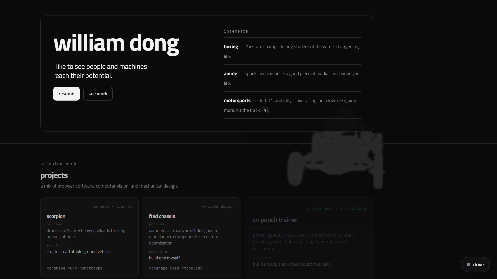

<div align="center">

# William Dong — Personal Site

**Engineer, builder, and competitive boxer.** A static, no-build personal site with a
flagship, in-browser **CV Punch Trainer** that grades boxing form in real time.

[](https://williamdong.dev)
&nbsp;
[](https://williamdong.dev/games/punch-trainer)




</div>

---

## ✨ Highlights

- **Real-time CV boxing coach** — your webcam feeds a pose model (33 landmarks/frame); a
  custom biomechanics engine detects each punch and scores it, all **locally in the browser**.
- **Zero build step** — hand-written HTML, CSS, and ES modules. Clone it and open it.
- **Interactive touches** — a spinning CAD backdrop, project detail modals with live 3D
  models, and a hidden drift game (press <kbd>G</kbd>).
- **Fast by default** — the homepage ships no WebGL; heavy libraries load on demand.

## 🥊 CV Punch Trainer (the flagship)

A real-time, in-browser boxing-form coach. No install, no upload — the video never leaves
your device.

- **Pose** — MediaPipe BlazePose reads 33 body landmarks per frame on the GPU.
- **Biomechanics** — de Leva center-of-mass, base of support, and per-frame features.
- **Detection** — punch detection with a jab / cross / hook / uppercut classifier.
- **Scoring** — five-dimension technique scoring (balance, guard, kinetic-chain sequencing,
  retraction) with plain-language coaching notes.
- **No webcam?** A **demo** button runs the whole pipeline offline on a synthetic boxer.

The analysis engine is vendored from my **Kodawari** project — the same
`pose → features → detection → scoring` pipeline — with a thin streaming wrapper
(`engine/live.js`) added on top for real-time use.

## 🛠 Built with

Vanilla **HTML · CSS · JavaScript (ES modules)** · **MediaPipe BlazePose** ·
`<model-viewer>` for 3D CAD · deployed on **Vercel**. No framework, no bundler.

## 🚀 Run locally

ES modules need `http` (not `file://`), so serve the folder with any static server:

```bash
python -m http.server 4176
```

Then open <http://localhost:4176/>. `localhost` is a secure context, so the webcam works from
the dev server; the pose model loads from a CDN on first use.

## 📦 Deploy

It's fully static — no framework preset needed.

- **Git:** import the repo in Vercel (Framework preset *Other*, no build command, output = repo root).
- **CLI:** `vercel` (first run), then `vercel --prod`.

`vercel.json` sets `cleanUrls` (so `/games/punch-trainer` resolves) and a
`Permissions-Policy: camera=(self)` header for the webcam.

## 🗂 Structure

```
index.html            Landing page (hero, projects, story, contact)
styles.css            Design tokens + landing styles
main.js               Landing interactions (reveal-on-scroll, project modals)
drift.js              The cursor-becomes-a-drift-car easter egg
games/
  punch-trainer.html  The CV Punch Trainer page
  punch-trainer.js    Real-time control + HUD
  engine/             Vendored analyzer (pose · biomech · detect · scoring · live)
vercel.json           cleanUrls + camera permissions-policy
assets/               Renders, 3D models, and résumé PDF
```

<div align="center">
<sub>Built by William Dong · <a href="https://williamdong.dev">williamdong.dev</a></sub>
</div>
